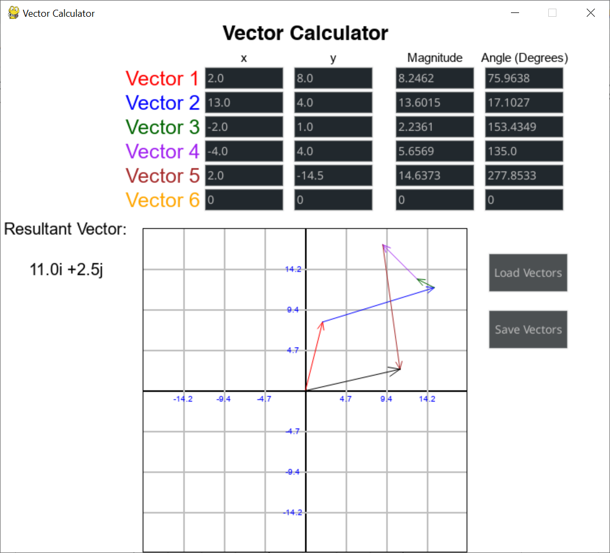

# Vector Calculator

By James Mylan
## Project Description
This program allows for the addition of up to six 2-dimensional vectors, entered in eithier x-y coordinate form or magnitude-angle form. It calculates the resultant vector and displays it algebraically, as well as displaying a graphical representation on the Cartesian plane. This application can be used as a tool in solving problems involving vectors from fields such as Mathematics and Physics. The program is codede in Python and utilises the Pygame and Pygame-GUI libraries.
## Prerequsites
* Python 3 installation
* Pip package manager
## Installation instructions
The program can be download through the GitHub website or through the command line.
```
git clone https://github.com/JamesMylan/Task3
cd Task3
```

Requirements can be installed from the bash/command prompt via
```
pip install -r requirements.txt
```
The program can then be run via
```
python gui.py
```
## Instructions for Use
There are two grouped fields, the fields labelled "x" and "y", and the fields labelled "Magnitude" and "Angle (Degrees)". Any real numbers can be entered into any of the fields, and convesion will occur between the two groups. To the left of the graph is the resultant vector (all the input vectors added together) in algebraic form. To the right are the "Load Vectors" and "Save Vectors" buttons. These will load vectors from 'savedvectors.csv' and save the inputted vectors to the file, respectively. The graph shows each individual vector plotted from the end of the previous vector. The first vector is plotted from the origin. Each vector is colourcoded by the text next to the entry field, and the resultant vector is shown in black and plotted from the origin. The program can be exited by clicking the cross in the window title bar.